# AWS IAM Security Concepts Lab

Concept

AWS Identity and Access Management (IAM) manages secure access to AWS services and resources.  
There is no additional charge for IAM; you pay only for the AWS services your users access.


Purpose of Lab

- Create an IAM group and users.
- Attach an AWS managed policy to the group of users.


Scenario

AWS Core Security Concepts

The stock exchange wants to restrict support engineers' system access to only those actions required for their specific roles, enhancing overall security controls.


Objectives

- Compare IAM users, roles, and groups and their creation processes.
- Analyze the structure and components of IAM policies.
- Explain the AWS Shared Responsibility Model and compliance programs.
- Implement IAM best practices for secure access management.


IAM Step 1

AWS Identity and Access Management (IAM) manages secure access to AWS services and resources.

There is no additional charge for IAM; you pay only for the AWS services your users access.

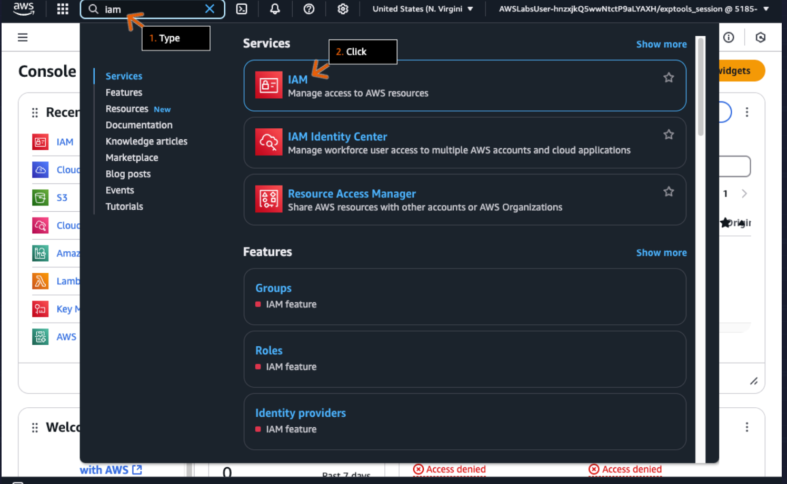


Step 2 — Create User Groups

IAM groups define permissions for multiple users.

Users added to a group inherit all group permissions.

In the left navigation pane, click **User groups**.

In the User groups section, click **Create group**.

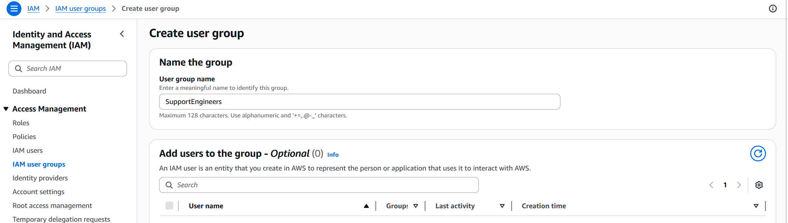


Step 3 — Add Name of User Group

User groups:

- Can include multiple users
- Allow users to belong to multiple groups
- Cannot contain other user groups

The group name used:

```text
SupportEngineers
```


Step 4 — Attach Policies

A policy defines permissions on AWS.  
When a user or role makes a request, AWS checks their associated policies to determine what they can do.

In the Attach permissions policies search box, type:

```text
AmazonEC2ReadOnlyAccess
```

and press Enter.

- Choose the checkbox to select AmazonEC2ReadOnlyAccess.
- Under Description, review the policy description.
- Click Create user group.

If you get an error, check the group name spelling and capitalization. You must use:

```text
SupportEngineers
```

exactly as shown.

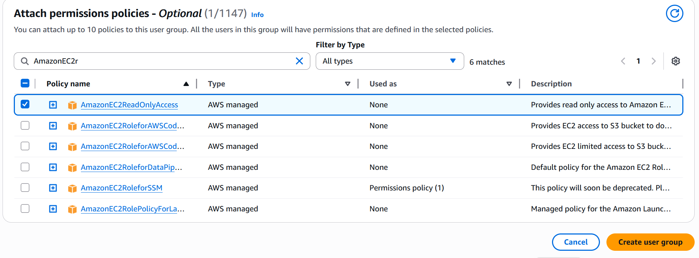

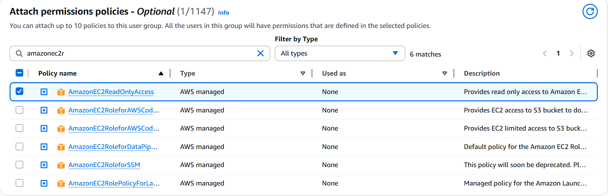


Step 5 — Create User

IAM users are identities you create in AWS for people or applications.

Each user gets a name and credentials that control their AWS access.

We recommend following the principle of least privilege: give IAM users only the minimum permissions they need to do their tasks on the AWS Management Console.

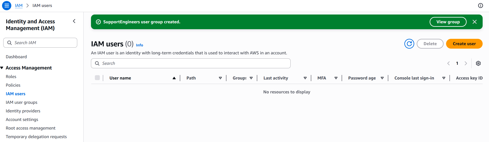

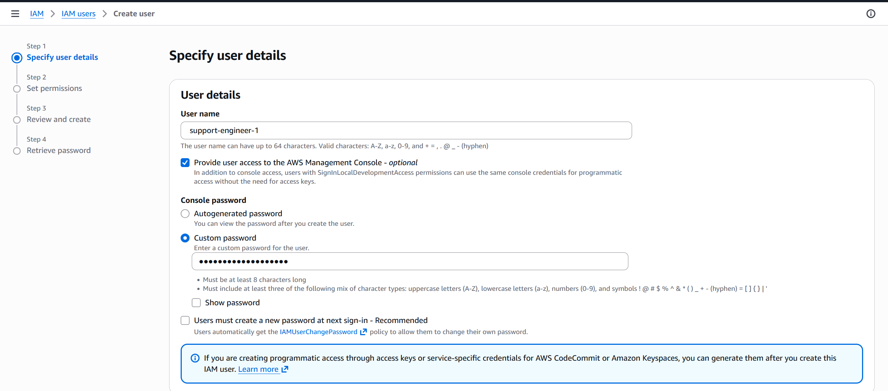


Step 6 — Set Permissions

Users can get permissions in two ways:

- By joining groups (they receive the group’s permissions)
- Through permissions attached directly to their user account

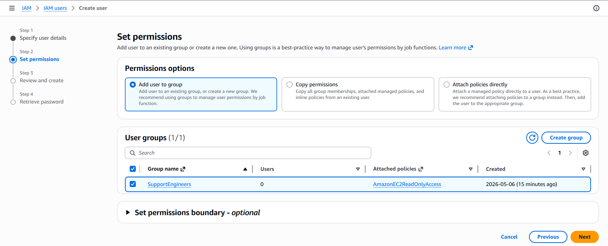


Step 7 — Set Tags

Tags are labels for AWS resources that help you:

- Organize resources
- Search and filter
- Manage resources

Each tag has a key and optional value.

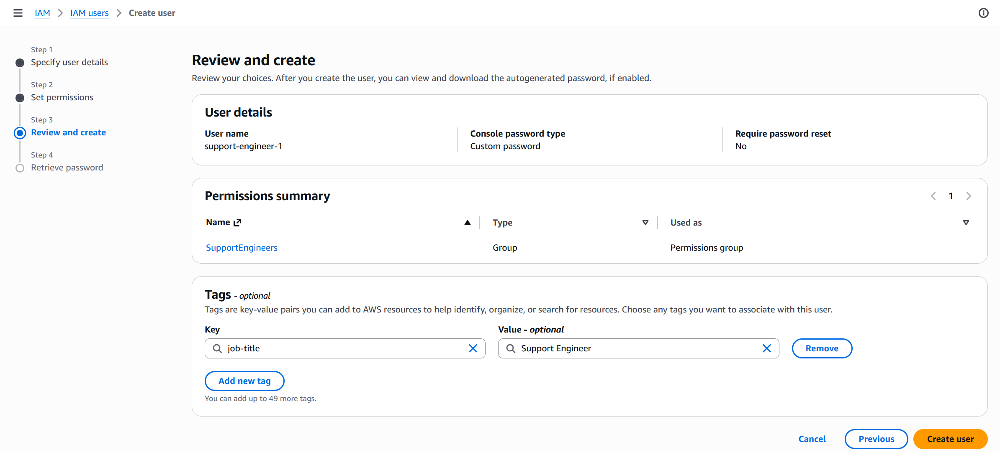


User Created Successfully

The IAM user was successfully created with console access credentials.

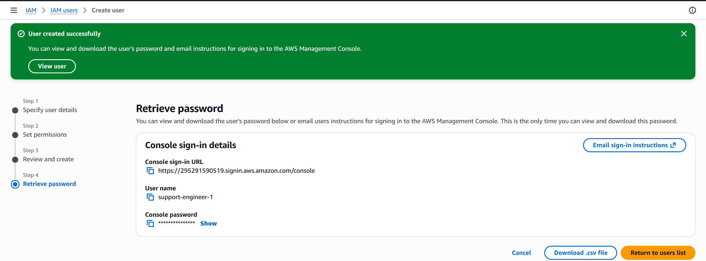


Step 8 — Administrator Security Task

Test new users:

- Sign in as new users to verify their access level.

Manage credentials:

In a new incognito or private browsing window address bar, paste the console sign-in URL that you copied in an earlier step, and then press Enter.

By using an incognito or private browsing window for this step, you can remain logged in with your original credentials in the previous browser window.

Then enter the username and password of the created user group.

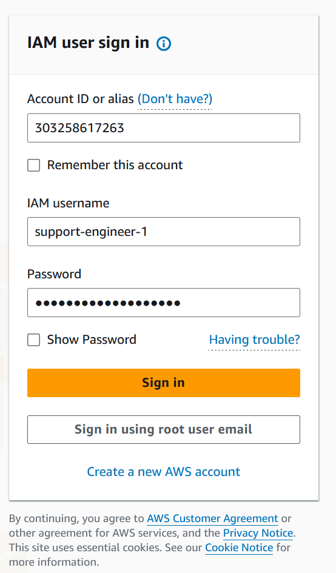


Step 9 — EC2 Setup

Amazon Elastic Compute Cloud (Amazon EC2) is a web service that provides resizable compute capacity in the cloud.

The service is designed to help streamline web-scale cloud computing.

On the top navigation bar, click the Region selector to expand the dropdown list.

- Keep or choose US East (N. Virginia) us-east-1.
- Go to the next step.

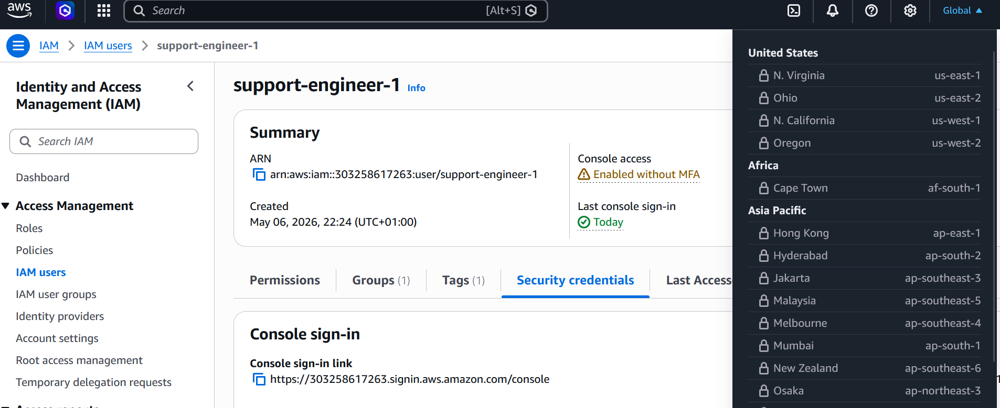

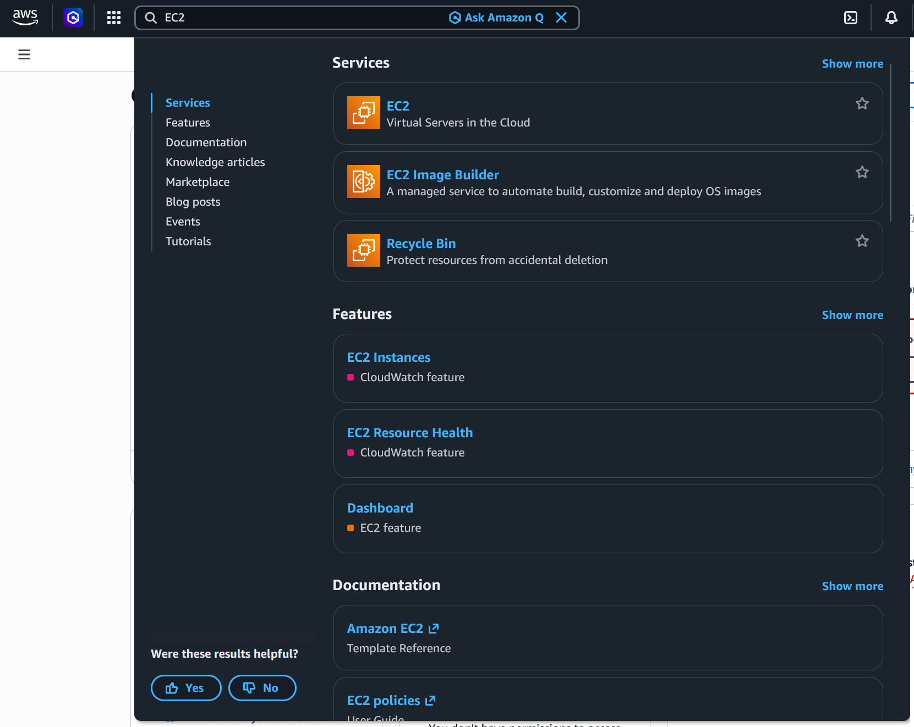


Step 10

The Amazon EC2 Dashboard displays metrics on the number of resources by type.

On the Dashboard, in the Resources section, click Instances (running).

In the Instances section, choose the checkbox to select the WebServer instance.

- Click Instance state to expand the dropdown list.
- Choose Terminate (delete) instance.

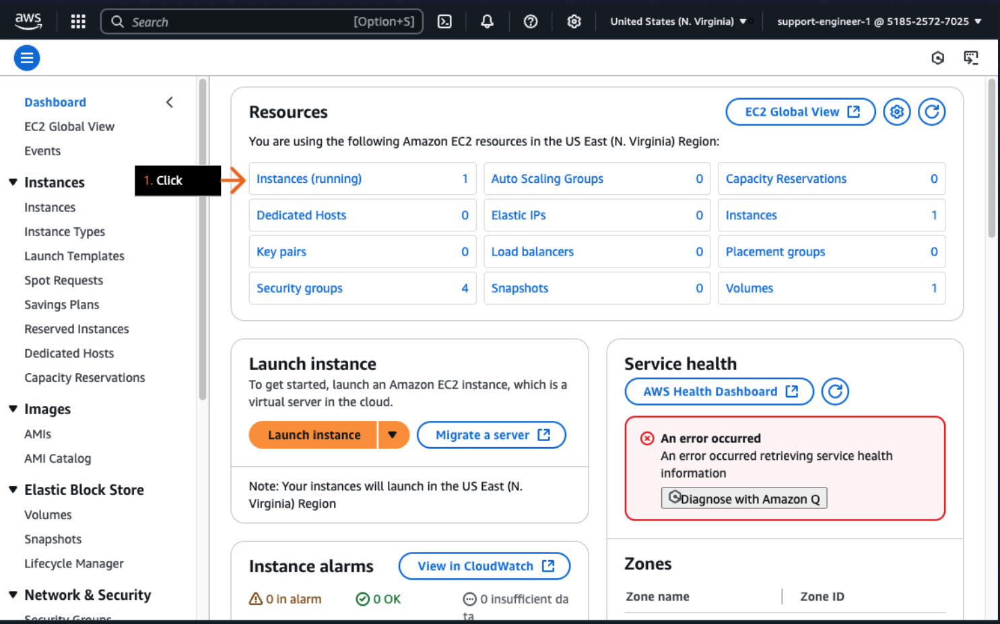

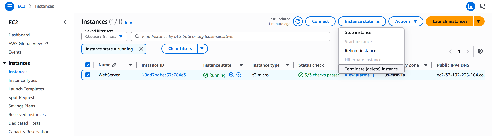


Users can only perform actions allowed by the assigned IAM policies.

Because an IAM principal is denied access by default, users must be explicitly allowed to perform actions. All other actions are implicitly denied access.

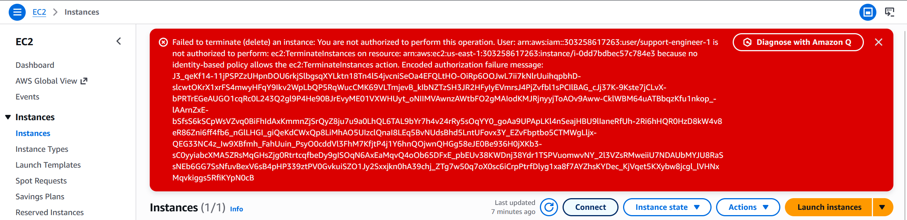


Step 11

Grant the "SupportEngineers" group read-only access to Amazon RDS.

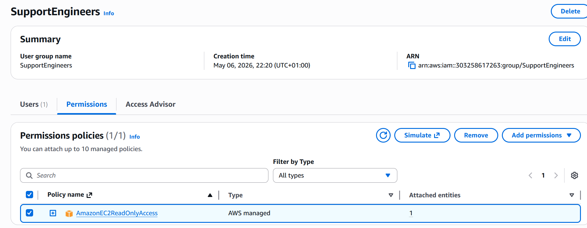


# Validation Successful

The IAM group successfully received the required permissions.

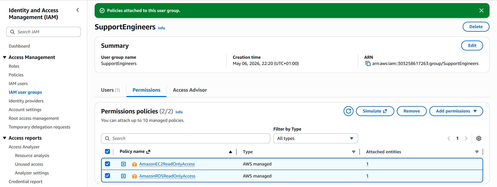

```
